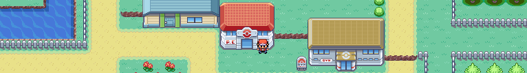

# CodeAdventures

This project is a game developed in C language along with the Allegro library with the aim of carrying out a more practical software development activity for students and group members. The objective of the game is to teach computational thinking to new programming students.

Nintendo, please **don't** sue us.

## Sprites

All sprites used are from [The Spriters Resource.](https://www.spriters-resource.com/)

## Running the game

If you do not have Code::Blocks installed and configured with the MinGW compiler installed and just want to play the game, follow the instructions below:

1. clone or download this repository
2. extract the repository folder
3. in the root folder of the project, go to `bin/Release`
4. copy both the files in the root directory: `allegro_monolith-5.2.dll` and `CodeAdventures.exe`
5. paste the files in the root folder
6. run `CodeAdventures.exe` and have fun!

At the moment, the game's text is entirely in Brazilian Portuguese.

## Future of this project

This is a school project, which means it's gonna probably be forgotten in the near future. But, if you want to improve it, feel free to do it or maybe even remake it in a object oriented language.
